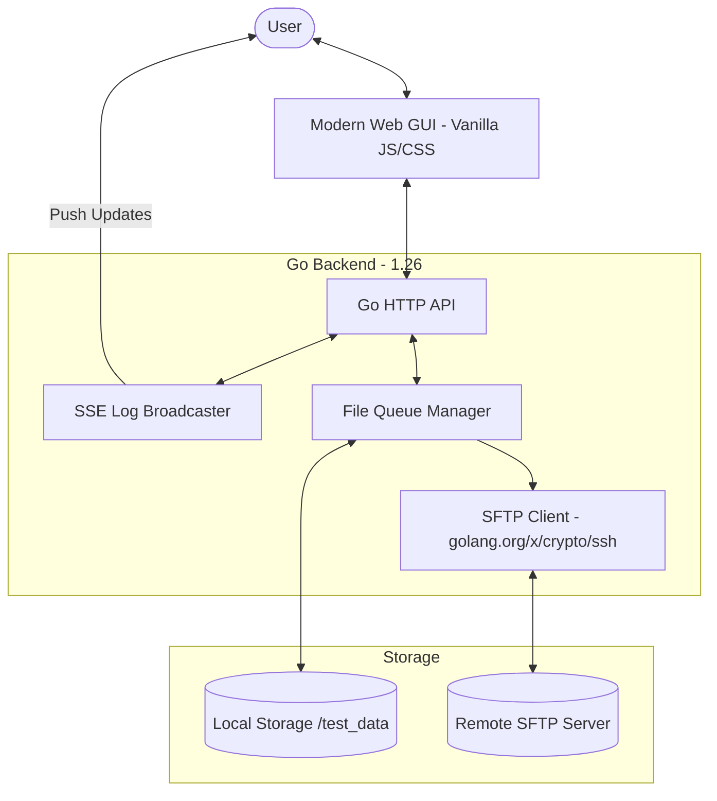

# 🚀 Uplarr

<p align="center">
  
  
  
  
  
</p>

**Uplarr** is a high-performance, zero-bloat Go application designed to bridge the gap between local storage and remote SFTP servers. With a sleek modern Web GUI, real-time progress logging via SSE, and robust verification logic, Uplarr ensures your data moves safely and efficiently.

---

## 📊 System Architecture



---

## ✨ Key Features

- 🛠 **Dynamic Configuration**: Configure and test SFTP connections, including host key verification toggles, directly in the browser.
- 📡 **Real-time SSE Logs**: Integrated Server-Sent Events (SSE) provide live terminal-style feedback for all operations.
- 📦 **File Queueing**: Select specific files or directories from your local mount for targeted uploads.
- ✅ **Integrity Verification**: Post-upload verification ensures remote files match local sources exactly.
- 🧹 **Smart Cleanup**: Automatically remove local files only after successful remote verification.
- 🐳 **Enterprise Ready**: Multi-arch Docker images (`amd64`, `arm64`) and automated security scanning.

---

## 📸 Interface Preview

> [!TIP]
> The interface is designed to be fully responsive and works beautifully on mobile or desktop.

| Feature | Description |
| :--- | :--- |
| **File Browser** | Interactive list with checkboxes for batch queuing. |
| **Config Panel** | Secure form for credential and host management. |
| **Log Terminal** | Real-time scrollable window for process auditing. |

---

## 🛠 Quick Start

### Using Docker (Recommended)

```bash
docker run -d \
  -p 8080:8080 \
  -v /your/local/data:/root/test_data \
  --name uplarr \
  ghcr.io/arumes31/uplarr:latest
```

### Using Docker Compose

Create a `docker-compose.yml` file:

```yaml
services:
  uplarr:
    image: ghcr.io/arumes31/uplarr:latest
    ports:
      - "8080:8080"
    environment:
      - LOCAL_DIR=/data
    volumes:
      - /path/to/local/data:/data:ro
```

Run with: `docker compose up -d`

### Local Development

1. **Prerequisites**: Go 1.26+ installed.
2. **Install & Run**:
   ```bash
   go mod download
   go run .
   ```
3. **Access**: Open [http://localhost:8080](http://localhost:8080).

---

## ⚙️ Configuration (Environment Variables)

| Variable | Description | Default |
| :--- | :--- | :--- |
| `LOCAL_DIR` | Directory to monitor for files | `./test_data` |
| `WEB_PORT` | Port for the Web GUI | `8080` |

*All SFTP parameters are managed dynamically via the Web UI.*

---

## 🧪 Testing & Quality

Uplarr maintains **97.9% code coverage**, ensuring every critical path is verified.

```bash
# Run full suite
go test -v ./...

# View coverage report
go test -coverprofile=coverage.out ./...
go tool cover -html=coverage.out
```

---

## 🤝 Contributing

We welcome contributions! Please follow our streamlined workflow:

1. Fork the Project.
2. Create a Feature Branch (`git checkout -b feature/AmazingFeature`).
3. Commit Changes (`git commit -m 'Add some AmazingFeature'`).
4. Push to the Branch (`git push origin feature/AmazingFeature`).
5. Open a Pull Request to the `v2_test` branch.

---

## 📄 License

Distributed under the **MIT License**. See `LICENSE` for more information.

---
<p align="center">
  <i>Built with ❤️ using Go and Vanilla JS.</i>
</p>
