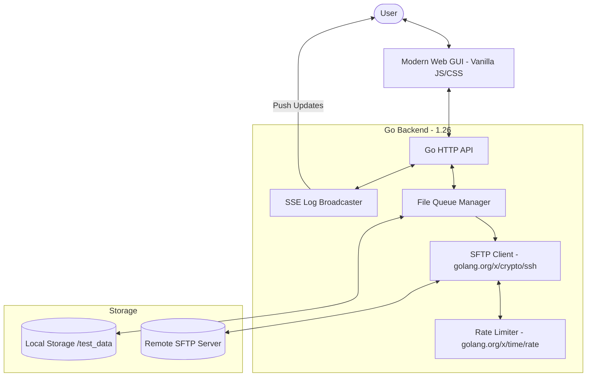

<p align="center"></p>

# 🚀 Uplarr


<p align="center">
  
  
  
  
  
  
  
  
</p>

**Uplarr** is a high-performance, zero-bloat Go application designed to bridge the gap between local storage and remote SFTP servers. With a sleek modern Web GUI, real-time progress logging via SSE, and robust verification logic, Uplarr ensures your data moves safely and efficiently.

---

## 📊 System Architecture



---

## ✨ Key Features

- 📦 **Background Queue**: Persistent task manager that survives container restarts, with full queue management and pause/resume support.
- 📁 **File Management**: Create folders, rename, and delete files on both local and remote filesystems.
- 📂 **WinSCP-Style Browser**: Advanced dual-pane interface for browsing local and remote files with full directory navigation.
- 🔄 **Mass Rename Utility**: Powerful regex-based bulk renaming with real-time preview and sequence formatting (`$idx`).
- 🖱️ **Drag & Drop**: Seamlessly upload files by dragging them from the local pane to the remote directory of your choice.
- 🛠 **Dynamic Configuration**: Configure and test SFTP connections, including host key verification toggles and advanced latency floor tuning.
- 📉 **Compact View Mode**: Toggleable high-density interface for managing large file structures with horizontal layout optimization.
- 📡 **Real-time SSE Logs**: Integrated Server-Sent Events (SSE) provide live terminal-style feedback for all operations.
- 🔐 **Encrypted Storage**: All persistent settings (including credentials) are AES-GCM encrypted in the browser with secure master-key management.
- 🤖 **Automated CI/CD**: Pushes to `main` trigger automated semantic versioning and cross-platform builds.
- 🐳 **Enterprise Ready**: Multi-arch Docker images (`amd64`, `arm64`) and automated security scanning via GitHub Container Registry.

---

## 📸 Interface Preview

> [!TIP]
> The interface is designed to be fully responsive and works beautifully on mobile or desktop.

| Feature | Description |
| :--- | :--- |
| **File Browser** | Interactive list with checkboxes for batch queuing. |
| **Config Panel** | Secure form for credential and host management. |
| **Log Terminal** | Real-time scrollable window for process auditing. |

---

## 🛠 Quick Start

### Using Docker (Recommended)

Uplarr now provides automated multi-arch builds (`amd64`, `arm64`) via the GitHub Container Registry.

```bash
docker pull ghcr.io/arumes31/uplarr:latest

docker run -d \
  -p 8080:8080 \
  -v /your/local/data:/root/test_data \
  --name uplarr \
  ghcr.io/arumes31/uplarr:latest
```

### Using Docker Compose

For a complete production-ready setup using the GitHub Container Registry image, see the [docker-compose.ghcr.yml](docker-compose.ghcr.yml) example.
The project is configured to automatically increment versions and push images to GHCR on every push to `main`.

Quick setup: `docker compose -f docker-compose.ghcr.yml up -d`

Or create a manual `docker-compose.yml`:

```yaml
services:
  uplarr:
    image: ghcr.io/arumes31/uplarr:main
    ports:
      - "8080:8080"
    environment:
      - LOCAL_DIR=/data
      - CONFIG_DIR=/config
      - AUTH_PASSWORD=your_secure_password
    volumes:
      - ./config:/config:rw
      - /path/to/local/data:/data:ro
```


Run with: `docker compose up -d`

### Local Development

1. **Prerequisites**: Go 1.26+ installed.
2. **Install & Run**:
   ```bash
   go mod download
   go run .
   ```
3. **Access**: Open [http://localhost:8080](http://localhost:8080).

---

## ⚙️ Configuration (Environment Variables)

| Variable | Description | Default |
| :--- | :--- | :--- |
| `LOCAL_DIR` | Directory to monitor for files | `./test_data` |
| `CONFIG_DIR` | Directory for application state (queue) | `./config` |
| `WEB_PORT` | Port for the Web GUI | `8080` |
| `AUTH_PASSWORD` | Password for Web UI authentication | (None) |

*All SFTP parameters are managed dynamically via the Web UI.*

---

## 💾 Storage & Persistence

Uplarr maintains a background queue that survives container and process restarts.

- **State File**: `.queue_state.json`
- **Location**: Stored in your configured `CONFIG_DIR` (defaults to `./config`).
- **Isolation**: Keeping state in a separate directory allows you to mount `LOCAL_DIR` as **read-only** (`:ro`), improving overall security for your media files.
- **Persistence**: The `CONFIG_DIR` mount **must be writable** (`:rw`) for the application to save its queue.

---

## 🔧 SFTP Tuning

### `MaxConcurrentRequestsPerFile`

The SFTP client uses up to **128** concurrent outstanding requests per file transfer (controlled by the `DefaultMaxConcurrentRequestsPerFile` constant in `internal/sftpclient/client.go`). This was raised from the library default of 64 to improve throughput on high-bandwidth / high-latency links.

**Compatibility notes:**
- **OpenSSH sshd**: Works well with 128 concurrent requests (tested).
- **ProFTPD mod_sftp**: Some configurations with strict per-connection request limits may reject transfers. If you encounter disconnects, reduce to 64.
- **FileZilla Server**: Generally works, but restrictive configurations may need a lower value.

**To change the value**, edit the `DefaultMaxConcurrentRequestsPerFile` constant in [`internal/sftpclient/client.go`](internal/sftpclient/client.go) and rebuild. A safe fallback value is `64`.

---

## 🧪 Testing & Quality

Uplarr maintains **97.9% code coverage**, ensuring every critical path is verified.

```bash
# Run full suite
go test -v ./...

# View coverage report
go test -coverprofile=coverage.out ./...
go tool cover -html=coverage.out
```

---

## 🤝 Contributing

We welcome contributions! Please follow our streamlined workflow:

1. Fork the Project.
2. Create a Feature Branch (`git checkout -b feature/AmazingFeature`).
3. Commit Changes (`git commit -m 'Add some AmazingFeature'`).
4. Push to the Branch (`git push origin feature/AmazingFeature`).
5. Open a Pull Request to the `v2.2` branch.

---

## 📄 License

Distributed under the **MIT License**. See `LICENSE` for more information.

---
<p align="center">
  <i>Built with ❤️ using Go and Vanilla JS.</i>
</p>
